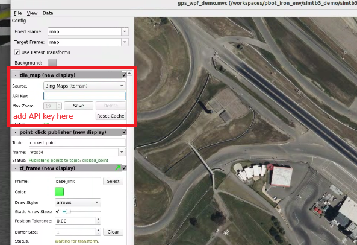
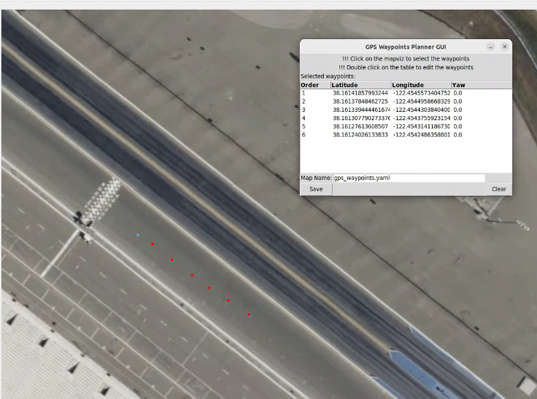
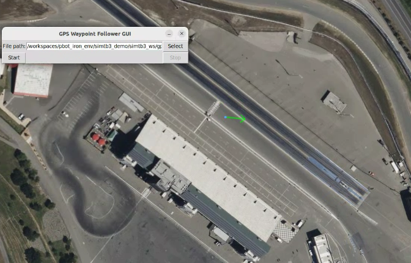

# Turtlebot 3 navigation simulation demo

## Prerequisites
* [Docker Engine](https://docs.docker.com/engine/install/)
* [Vscode](https://code.visualstudio.com/download)
* [Vscode Dev Containers extension](vscode:extension/ms-vscode-remote.remote-containers)

## Setup Demo

### Initial setup
* First, after cloning this repo, open it with devcontainer in vscode. Please make sure that the docker engine already started.
* Next, open a terminal in vscode and run `bash setup.bash` to process initial setup and install necessary packages for the demo.
* (For Ubuntu Host), open a host terminal and run `export DISPLAY=:0 && xhost +local:docker`
* (For Windows Host), install and run [GWSL](https://apps.microsoft.com/detail/9NL6KD1H33V3?launch=true&mode=full&hl=en-us&gl=kr&referrer=bingwebsearch&ocid=bingwebsearch).

### Get Bing Maps API key
Bing Maps API key is necessary to retrieve the bing map from mapviz. Please following this guide: [getting a bing maps key](https://learn.microsoft.com/en-us/bingmaps/getting-started/bing-maps-dev-center-help/getting-a-bing-maps-key).

## Run the Demo

### GPS Waypoints Planner
The purpose of this is to make a desired list of gps waypoints for the robot to follow.

* First, open a vscode terminal and run `bash run_bringup.bash` to start the simulation world and robot.
* Next, open another vscode terminal and run `bash run_gps_nav_waypoints_planner.bash`. A set of GUIs will appear: **mapviz GUI** and **GPS Waypoints Planner GUI**

* Then, add Bing Maps API key to mapviz GUI to retrieve the maplet of current gps position and save it. \

* The **Blue** point on the map is the current position of the robot. To make a list of waypoints, click the desired position on the map, the **Red** points will appear on the map to mark selected waypoints. These points will also appear on the **GPS Waypoints Planner GUI**. \

* To edit the waypoints, double click to the value desired to change and input the new value, then *Enter* to save the changes.
* At initial, the yaw is 0.0 radiant meaning facing to the East based on the ENU convention. It can be editted to plan a desired pose for the robot.
* After finishing, Click on **Save** button to save the waypoints file with the file name and path as in file name textbox (edit it if necessary).

### GPS Waypoints Follower
In this run, the robot navigate to each waypoints in loaded file.

* First, open a vscode terminal and run `bash run_bringup.bash` to start the simulation world and robot.
* Next, open another vscode terminal and run `bash run_gps_nav_waypoints_follower.bash`. A set of GUIs will appear: \
~ **mapviz GUI** \
~ **GPS Waypoints Follower GUI** \
~ **navigation rviz GUI**

* In **GPS Waypoints Follower GUI**, select the path of desired waypoints list (saved following above instruction), then click **Start** button to make to robot navigate to each waypoints. Use **Stop** button to stop the run.
* Waypoints loaded will be shown on the map.\

Still Updating...

